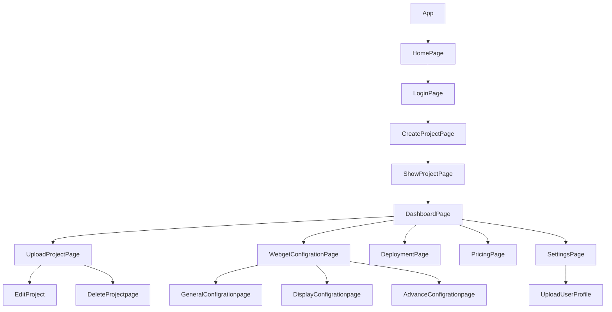

> 💻 PROJECT NAME ✨ => 💻 zuraventureAssign
> 
 

## 🔗 Profile Links✨

| Resume | Github                                                                                                                                   | Linkedin                                                                                                                                                            | Portfolio                                                                                                                                    | Blogger                                                                                                                                                           | Medium                                                                                                                                    |
| ------------- | ---------------------------------------------------------------------------------------------------------------------------------------- | ------------------------------------------------------------------------------------------------------------------------------------------------------------------- | -------------------------------------------------------------------------------------------------------------------------------------------- | -------------------------------------------------------------------------------------------------------------------------------------------- | -------------------------------------------------------------------------------------------------------------------------------------------- |
|  | |  | | | |  

## 💫Tech-Stack->

- #### For Frontend:-
   - `HTML5`
  - `CSS3`
  - `JavaScript `
  - `ReactJS`
  - `ReactJS`
    - #### For Backend:-
   - `NodeJS`
   - `ExpressJS`
    - `MongoDB `
- #### For deploy database:- 
    
     - `Vercel`
   
- #### For Styling:-  
   - `Chakra UI `
  
- #### For live Project: -
   - `Vercel`
   

## ⭕Steps to run our project:

✨Clone the repository.

✨Run the command `npm install` in both the frontend and backend folders.

✨Run the command `npm run server` in the backend folder.

✨Run the command `npm start` in the frontend folder on localhost:3000.

---
## Features ✨:-
---
 | Serial No            | Feature                                                              |
| ----------------- | ------------------------
| 1 | User login,  upload profile page|
| 2 | Home Page Design, responsive design |
| 3 |Create Project, Show Project list  |
| 4 | Upload Project, Edit & delete Project|
| 5 | Dashboard page general & display  |

---
# Package.json(Dependency)✨:-

 | Serial No            | Backend                      |  Frontend      |
| ----------------- | ---------------------|------------------------ |
| 1 | nodemon | Chakra-ui |
| 2 | mongoose | React Router dom |
| 3 | cors | redux , react-icons |
| 4 | dotenv | react-redux , react-thunk |
| 5 | express | react-hot-toast |

⭕Steps to use our project:
---

Zura Ventures Application lets you log in and Create a Project, show a Project list, and update, and delete Projects.

---✨Getting Started:

✨Initialize the Application: To begin using the application, navigate to the frontend terminal and execute the command npm start. This will start the application locally, making it accessible through your web browser at port 3000.

✨Home Page: Upon launching the application, users are greeted with the home page, offering essential options for interaction like the Create a Project popup.

---✨User Journey:

💫Login: Users are provided with the choice to log in. This initial step ensures a personalized experience within the application.

✨Add Project: Following a successful login, users are taken to the Create Project page.

✨Show Project List: Once the project setup is complete, users can click on any projects to go to the upload projects page. 

✨Upload User Profile: Users can upload profiles.

✨Edit and delete project data.

---

## Flow

---

<h1 align="center">✨Thank You✨</h1>

